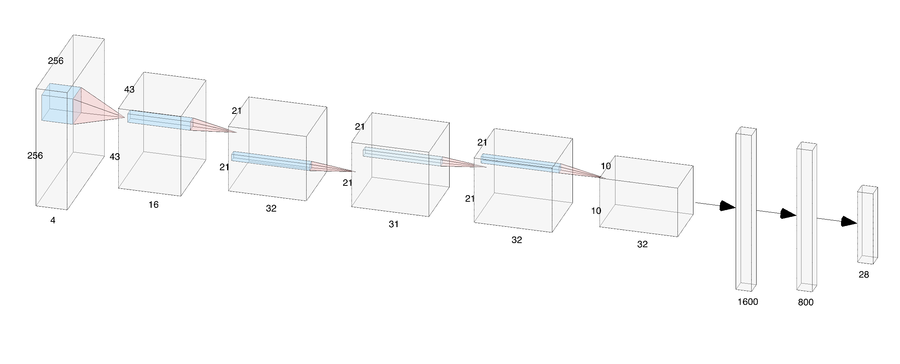
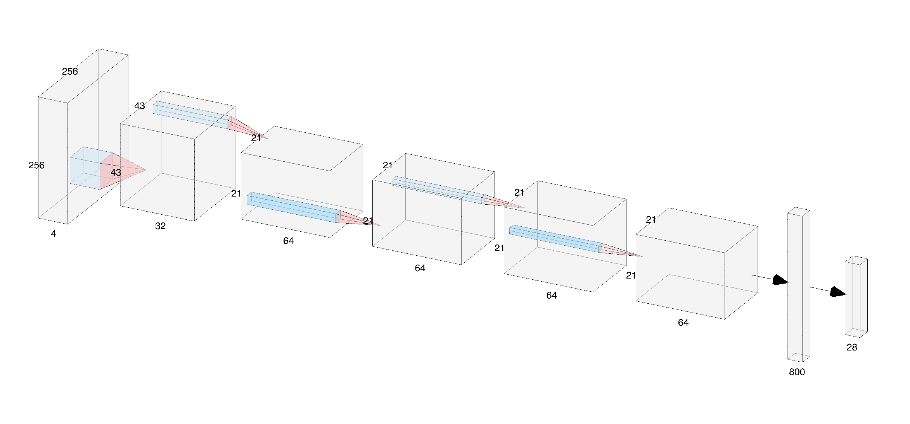
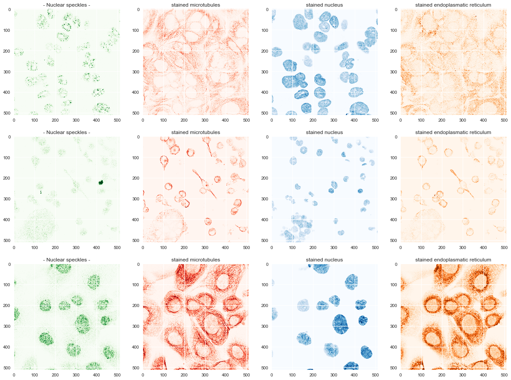
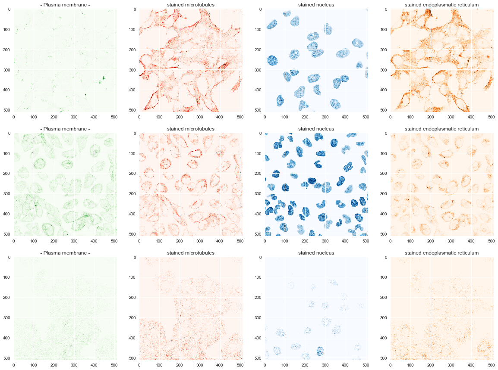

### CS 221 Project — Alex Lu 

**Fall Quarter, 2018** 

This project attempts the Kaggle challenge: [Human Protein Atlas Image Classification](https://www.kaggle.com/c/human-protein-atlas-image-classification/data)

The goal of the challenge is to develop a high-throughput method for analyzing fluorescence microscopy images. In particular, we hope to classify the subcellular localization of an unknown protein of interest based on fluorescence microscopy data with known localization of cellular nuclei, microtubules, and endoplasmic reticulum. 

Any combination of 28 binary labels that may be applied to indicate the subcellular localization of the protein of interest. 

```
label_names = {
    0:  "Nucleoplasm",  
    1:  "Nuclear membrane",   
    2:  "Nucleoli",   
    3:  "Nucleoli fibrillar center",   
    4:  "Nuclear speckles",
    5:  "Nuclear bodies",   
    6:  "Endoplasmic reticulum",   
    7:  "Golgi apparatus",   
    8:  "Peroxisomes",   
    9:  "Endosomes",   
    10:  "Lysosomes",   
    11:  "Intermediate filaments",   
    12:  "Actin filaments",   
    13:  "Focal adhesion sites",   
    14:  "Microtubules",   
    15:  "Microtubule ends",   
    16:  "Cytokinetic bridge",   
    17:  "Mitotic spindle",   
    18:  "Microtubule organizing center",   
    19:  "Centrosome",   
    20:  "Lipid droplets",   
    21:  "Plasma membrane",   
    22:  "Cell junctions",   
    23:  "Mitochondria",   
    24:  "Aggresome",   
    25:  "Cytosol",   
    26:  "Cytoplasmic bodies",   
    27:  "Rods & rings"
}
```


#### Architectures 
Two neural net architecture were built and trained from scratch. 
The first architecture contains 5 convolutional layers, ReLU activations, with interspersed max pool, drop out, followed by 2 fully connected layers. 


The second architecture contains 5 convolutional layers, LeakyReLU activations, with interspersed max pool, lower drop out, 1 fully connected layer. 


#### Image Examples
Here, we can see some examples of the images, which come in sets of 4 channels. 
These are images in which the protein of interest has a nuclear speckle distribution. 


These are images in which the protein of interest has a plasma membrane localization. 



### Dependencies

The project uses the following dependencies. 

```
numpy
torch
skimage
sklearn
```

### Running the Code: 
The models are contained in `models.py`. The models can be trained calling `python train.py` from the top level. The best model can be executed using `python test.py`. 


### Sources: 
[Classification of protein motifs based on subcellular localization uncovers evolutionary relationships at both sequence and functional levels](https://bmcbioinformatics.biomedcentral.com/articles/10.1186/1471-2105-14-229)

[Deep learning is combined with massive-scale citizen science to improve large-scale image classification](https://www.nature.com/articles/nbt.4225)

[Quantification and its Applications in Fluorescent Microscopy Imaging](https://onlinelibrary.wiley.com/doi/pdf/10.1111/j.1600-0854.2009.00938.x)

[Visualization and Analysis of 3D Microscopic Images](https://journals.plos.org/ploscompbiol/article?id=10.1371/journal.pcbi.1002519)

[Automated Interpretation of Subcellular Patterns in Fluorescence Microscope Images for Location Proteomics](https://www.ncbi.nlm.nih.gov/pmc/articles/PMC2901544/)

[Accurate Classification of Protein Subcellular Localization from High-Throughput Microscopy Images Using Deep Learning.](https://www.ncbi.nlm.nih.gov/pubmed/28391243)

[Protein subcellular location pattern classification in cellular images using latent discriminative models](https://academic.oup.com/bioinformatics/article/28/12/i32/269639)
